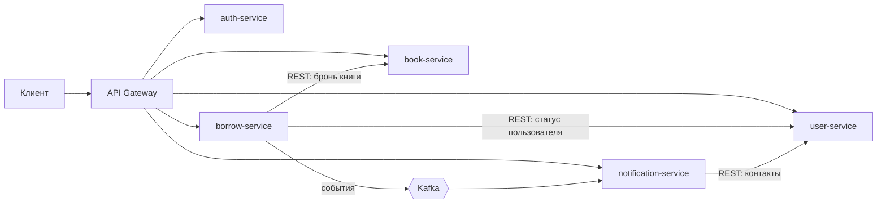

# Система управления библиотекой на микросервисах

Учебный проект по теме «Клиент-серверная архитектура и микросервисы». Монолит библиотеки разбит
на микросервисы: книги, пользователи, учёт выдачи, уведомления — плюс аутентификация, API Gateway
и Eureka. Java 21, Spring Boot 3.4, Spring Cloud, Maven.

За основу взят пример с пары (`BookService`, `UserService`, `BorrowService`, вызовы между сервисами
и Eureka), дальше добавлено то, что требует практическое задание по декомпозиции.

## Запуск

```bash
./scripts/build.sh      # сборка (Maven подтягивается wrapper'ом)
./scripts/run-all.sh    # поднять всё, H2 в памяти, Docker не нужен
./scripts/demo.sh       # сквозной сценарий через шлюз
./scripts/stop-all.sh
```

В IntelliJ IDEA: открыть корневой `pom.xml`, запустить конфигурацию «0 Все сервисы».

- шлюз — http://localhost:8080
- Eureka, кто зарегистрирован — http://localhost:8761
- Swagger любого сервиса — http://localhost:8082/swagger-ui.html

Есть `docker-compose.yml` (Postgres + Kafka + Eureka + сервисы), но на машине разработки Docker
не установлен, так что этот путь не проверялся.

## Сервисы

| Микросервис | Порт | Функции | Зависимости |
|---|---|---|---|
| book-service | 8082 | книги, поиск, бронь под выдачу | нет |
| user-service | 8083 | профили пользователей, контакты, блокировки | нет |
| borrow-service | 8084 | выдача, возврат, продление, просрочки | book-service, user-service |
| notification-service | 8085 | письма о выдаче, сроке, просрочке, возврате | user-service, события выдачи |
| auth-service | 8081 | регистрация, вход, JWT | нет |
| api-gateway | 8080 | маршруты, проверка JWT | все |
| discovery-server | 8761 | Eureka: реестр сервисов | нет |

Основные эндпоинты: `GET/POST /books`, `POST /users`, `POST /borrow`, `GET /notifications`,
`POST /auth/login`. Внутренние вызовы — на `/internal/**`, наружу через шлюз не публикуются.

## Взаимодействие



Адреса сервисов не прописаны в конфигах: шлюз ходит по `lb://book-service`, сервисы между собой —
по `http://user-service`, а конкретный хост и порт подставляет Eureka.

Синхронный REST — там, где без ответа нельзя продолжать (выдавать книгу или отказать). События —
там, где задержка не критична (письма): топик `library.borrow.v1`, события `borrow.issued`,
`borrow.due-soon`, `borrow.overdue`, `borrow.returned`. Персональных данных в событии нет, только
`userId`; ключ дедупликации — `eventId`.

### Выдача книги — сага

1. Проверить пользователя (user-service) и лимит выдач.
2. Создать выдачу в статусе PENDING.
3. Забронировать книгу в book-service — идемпотентно по `borrowId`.
4. Перевести выдачу в ACTIVE и положить событие в outbox.

Если шаг 3 или 4 упал — компенсация: выдача уходит в REJECTED, бронь освобождается. Если и
book-service недоступен, выдача помечается `copyReleasePending` и её добирает фоновая задача.

## Хранение данных

База на сервис, общих таблиц нет: `books`, `users`, `borrow`, `notifications`, `auth`
(в прототипе — H2 в памяти, в compose — Postgres). Данные соседей берутся по API или из снимка
в событии.

В borrow-service: `borrow_events` — журнал, который только дописывается (event sourcing, из него
строится история выдачи); `borrow_records` — проекция для чтения (CQRS); `outbox_messages` —
события, записанные в одной транзакции с выдачей.

Схему создаёт Hibernate (`ddl-auto: update`); в продакшене — Flyway.

## Отказоустойчивость

- таймауты 2/3 с на каждый вызов соседа;
- Resilience4j: ретраи только на сеть и 5xx, circuit breaker, fallback → 503 с понятным кодом;
- идемпотентность брони по `borrowId` и заголовок `Idempotency-Key` на создание выдачи;
- transactional outbox + relay: событие не теряется, после 5 неудач остаётся в таблице;
- дедупликация событий по `eventId` на стороне уведомлений;
- планировщики добирают зависшие саги, неосвобождённые книги и просрочки;
- сквозной `X-Request-Id` в логах, ошибки в формате RFC 7807, метрики Prometheus в `/actuator`.

Проверено вручную: если выключить book-service, выдача возвращает `503` и уходит в REJECTED,
а после его старта фоновая задача освобождает книгу.

## Безопасность

- JWT (RS256) от auth-service, публичный ключ у каждого сервиса, JWKS на `/.well-known/jwks.json`;
- токен проверяется и на шлюзе, и в сервисе;
- роли READER и LIBRARIAN: правила по URL плюс `@PreAuthorize` на методах;
- публичная регистрация всегда даёт READER, первый библиотекарь создаётся из конфигурации;
- вызовы между сервисами — `client_credentials` со scope `internal`;
- персональные данные только в user-service, в логах e-mail маскируется, пароли — BCrypt.

## План миграции монолита

Strangler Fig, по этапам, с флагом на каждое переключение:

1. Подготовка: разрезать монолит на модули по доменам, убрать межмодульные JOIN-ы, поднять логи и метрики.
2. Поставить API Gateway перед монолитом, вынести выдачу токенов.
3. Книги: своя БД, синхронизация через CDC, канареечный перевод чтения 1 % → 100 %, затем запись.
4. Уведомления: монолит публикует события через outbox, новый сервис их слушает.
5. Пользователи: двойная запись, фоновая сверка, таблица соответствия id.
6. Учёт выдачи — последним: локальная транзакция заменяется сагой.
7. Вывод монолита: удалить код и legacy-таблицы.

Без простоя: схема меняется по expand/contract (добавили → заполнили → переключили чтение →
удалили старое), деплой rolling, откат — возврат флага.

## Тесты

```bash
./scripts/build.sh --with-tests
```

24 теста: подпись и проверка JWT, матрица прав в book-service, идемпотентность брони, сага целиком
(успех, блокировка пользователя, отказ book-service, компенсация, `Idempotency-Key`, лимит),
дедупликация уведомлений.

## Упрощения прототипа

H2 вместо Postgres и HTTP вместо Kafka в локальном профиле (тот же outbox, другая реализация
`EventSink`); письма пишутся в лог; свой auth-service вместо Keycloak; ключ подписи лежит в
репозитории — он только для демо.
