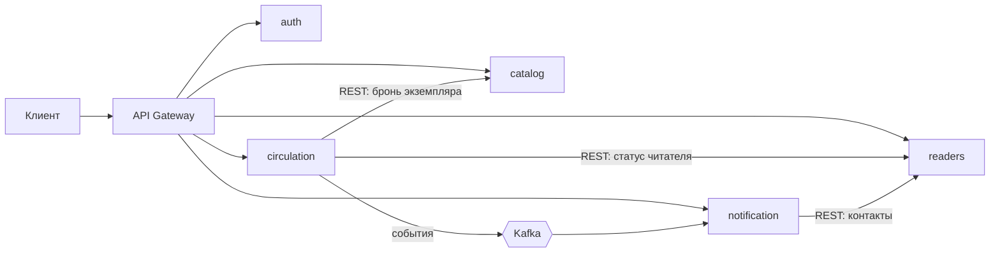

# Система управления библиотекой на микросервисах

Учебный проект: монолит библиотеки (каталог, читатели, учёт выдачи, уведомления) разбит на пять
микросервисов за API Gateway. Java 21, Spring Boot 3.4, Maven.

## Запуск

```bash
./scripts/build.sh      # сборка (Maven подтягивается wrapper'ом)
./scripts/run-all.sh    # поднять все сервисы, H2 в памяти, Docker не нужен
./scripts/demo.sh       # сквозной сценарий через шлюз
./scripts/stop-all.sh
```

В IntelliJ IDEA: открыть корневой `pom.xml`, запустить конфигурацию «0 Все сервисы».
Swagger — на каждом сервисе: `http://localhost:8082/swagger-ui.html`.

Есть и `docker-compose.yml` (Postgres + Kafka + сервисы, профиль `docker,kafka`), но на машине
разработки Docker не установлен, так что этот путь не проверялся.

## Сервисы

| Микросервис | Порт | Функции | Зависимости |
|---|---|---|---|
| catalog-service | 8082 | книги, поиск, брони экземпляров | нет |
| readers-service | 8083 | профили читателей, контакты, блокировки | нет |
| circulation-service | 8084 | выдача, возврат, продление, просрочки | Каталог, Читатели |
| notification-service | 8085 | письма о выдаче, сроке, просрочке, возврате | Читатели, события Выдачи |
| auth-service | 8081 | регистрация, вход, JWT | нет |
| api-gateway | 8080 | маршруты, проверка JWT | все |

## Взаимодействие



Синхронный REST — там, где без ответа нельзя продолжать (выдать книгу или отказать). События — там,
где задержка не критична (письма). Внутренние вызовы идут на `/internal/**`, через шлюз они не
публикуются и требуют токена `client_credentials` со scope `internal`.

Топик `library.loans.v1`, события: `loan.issued`, `loan.due-soon`, `loan.overdue`, `loan.returned`.
В событии нет персональных данных — только `readerId`. Ключ дедупликации — `eventId`.

### Выдача книги — сага

1. Проверить читателя (readers-service) и лимит выдач.
2. Создать выдачу в статусе PENDING.
3. Забронировать экземпляр в каталоге — идемпотентно по `loanId`.
4. Перевести выдачу в ACTIVE и положить событие в outbox.

Если шаг 3 или 4 упал — компенсация: выдача уходит в REJECTED, бронь освобождается. Если и каталог
недоступен, выдача помечается `copyReleasePending` и её добирает фоновая задача.

## Хранение данных

База на сервис, общих таблиц нет: `catalog`, `readers`, `circulation`, `notifications`, `auth`
(в прототипе — H2 в памяти, в compose — Postgres). Данные соседей берутся по API или из снимка
в событии.

В сервисе выдачи: `loan_events` — журнал, который только дописывается (event sourcing, из него
строится история выдачи); `loans` — проекция для чтения (CQRS); `outbox_messages` — события,
записанные в одной транзакции с выдачей.

Схему создаёт Hibernate (`ddl-auto: update`); в продакшене — Flyway.

## Отказоустойчивость

- таймауты 2/3 с на каждый вызов соседа;
- Resilience4j: ретраи только на сеть и 5xx, circuit breaker, fallback → 503 с понятным кодом;
- идемпотентность брони по `loanId` и заголовок `Idempotency-Key` на создание выдачи;
- transactional outbox + relay: событие не теряется, после 5 неудач остаётся в таблице;
- дедупликация событий по `eventId` на стороне уведомлений;
- планировщики добирают зависшие саги, неосвобождённые экземпляры и просрочки;
- сквозной `X-Request-Id` в логах, ошибки в формате RFC 7807, метрики Prometheus в `/actuator`.

Проверено вручную: если выключить каталог, выдача возвращает `503 catalog_unavailable` и уходит в
REJECTED, а после старта каталога фоновая задача освобождает экземпляр.

## Безопасность

- JWT (RS256) от auth-service, публичный ключ у каждого сервиса, JWKS на `/.well-known/jwks.json`;
- токен проверяется и на шлюзе, и в сервисе;
- роли READER и LIBRARIAN: правила по URL плюс `@PreAuthorize` на методах;
- публичная регистрация всегда даёт READER, первый библиотекарь создаётся из конфигурации;
- вызовы между сервисами — `client_credentials` со scope `internal`;
- персональные данные только в readers-service, в логах e-mail маскируется, пароли — BCrypt.

## План миграции монолита

Strangler Fig, по этапам, с флагом на каждое переключение:

1. Подготовка: разрезать монолит на модули по доменам, убрать межмодульные JOIN-ы, поднять логи и метрики.
2. Поставить API Gateway перед монолитом, вынести выдачу токенов.
3. Каталог: своя БД, синхронизация через CDC, канареечный перевод чтения 1 % → 100 %, затем запись.
4. Уведомления: монолит публикует события через outbox, новый сервис их слушает.
5. Читатели: двойная запись, фоновая сверка, таблица соответствия id.
6. Учёт выдачи — последним: локальная транзакция заменяется сагой.
7. Вывод монолита: удалить код и legacy-таблицы.

Без простоя: схема меняется по expand/contract (добавили → заполнили → переключили чтение →
удалили старое), деплой rolling, откат — возврат флага.

## Тесты

```bash
./scripts/build.sh --with-tests
```

24 теста: подпись и проверка JWT, матрица прав в каталоге, идемпотентность брони, сага целиком
(успех, отказ читателя, отказ каталога, компенсация, `Idempotency-Key`, лимит), дедупликация
уведомлений.

## Упрощения прототипа

H2 вместо Postgres и HTTP вместо Kafka в локальном профиле (тот же outbox, другая реализация
`EventSink`); письма пишутся в лог; свой auth-service вместо Keycloak; ключ подписи лежит в
репозитории — он только для демо.
